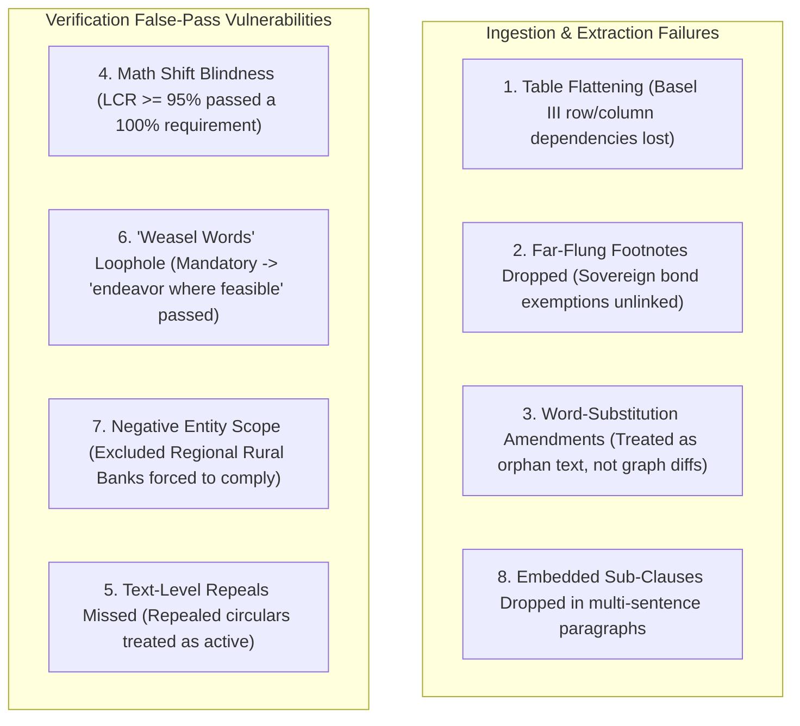

# Empirical Failure Catalog & Vulnerability Matrix

## 1. Executive Summary & Methodology
To replace theoretical assumptions with empirical data, the compliance platform was subjected to adversarial stress-testing across authentic regulatory circulars (e.g., **RBI Cyber Security Framework Circular RBI/2015-16/418**, **Basel III Capital Schedules**, **Large Exposure Rules**, and **Word-Substitution Amendments**).

The tests systematically probed:
1. **Ingestion & Extraction Capabilities** (Multi-column tables, far-flung footnotes, word-substitution circulars, embedded sub-clauses).
2. **The 8 Independent Verification Gates** (Probing the gates that passed to expose false-pass vulnerabilities).

The tests empirically exposed **8 critical system failures and false-pass vulnerabilities** in the current baseline architecture.

---

## 2. The 8 Empirically Exposed Failures & Vulnerabilities



---

### Detailed Failure Analysis & Root Cause Breakdown

### Failure 1: Multi-Column Table Flattening (Loss of Structural Schema)
* **Test Case**: Ingestion of the **Basel III Capital Adequacy Schedule** containing a 5-row, 4-column matrix ($\text{CET1} \ge 7.0\%$, $\text{Tier 1} \ge 8.5\%$, $\text{Total Capital} \ge 10.5\%$, $\text{Grand Total CRAR} \ge 11.5\%$).
* **Observed Result**: The baseline regex parser flattened all table rows into a single unformatted text blob and extracted only the last line. Discrete component thresholds ($\text{CET1}$, $\text{Tier 1}$) were dropped as standalone obligations.
* **Root Cause**: The current parser operates line-by-line without visual coordinate awareness or column-grid structure.
* **Required Architectural Fix**: Integrate **Docling Layout-Aware Table Extraction (Track B)** to convert tables into structured Markdown/JSON grids before graph ingestion.

---

### Failure 2: Far-Flung Footnote Disconnection (Dropped Statutory Exemptions)
* **Test Case**: Central Bank Master Direction on Large Exposures where Section 3.1 mandates a strict $20\%$ counterparty exposure cap, referencing Footnote 14 on page 5 which exempts sovereign debt securities and central government guarantees.
* **Observed Result**: Section 3.1 was extracted with `exceptions: []`. The sovereign bond exemption in Footnote 14 was disconnected and dropped.
* **Root Cause**: The sentence splitter treats footnotes as orphan paragraphs and fails to resolve parent-child cross-page pointers.
* **Required Architectural Fix**: Implement a **Footnote Citation Binder** that detects bracketed references (`[see Footnote 14]`) and creates explicit `(:Obligation)-[:HAS_EXCEPTION]->(:Exception)` graph edges.

---

### Failure 3: Word-Substitution Amendment Orphan Nodes (No In-Place Graph Diff)
* **Test Case**: An amendment circular stating: *"In Section 3.1 of Circular RBI/2015-16/418, the words 'within 2 to 6 hours' shall be substituted by the words 'within 1 hour'"*.
* **Observed Result**: The system created a disconnected new standalone rule rather than applying an in-place mutation to the existing Section 3.1 graph node.
* **Root Cause**: The system lacks an operational graph mutation engine (`APPLY_AMENDMENT`) to patch existing policy nodes.
* **Required Architectural Fix**: Introduce a **Graph Diff Operator** that parses patch semantics (`SUBSTITUTE`, `REPLACE`, `INSERT`, `DELETE`) and creates versioned node diffs.

---

### Failure 4: Numeric Mathematical Boundary Shift Blindness (False Pass)
* **Test Case**: A statutory mandate requires $\text{LCR} \ge 100\%$. An adversarial policy draft specifies $\text{LCR} \ge 95\%$ during quarter-end reporting.
* **Observed Result**: Gate 8 (Contradiction Gate) gave a **`[ PASS ]`**!
* **Root Cause**: The current verification engine is purely textual and lacks mathematical inequality solving.
* **Required Architectural Fix**: Wire in the **Tier 3 Z3 SMT Mathematical Proof Solver** (`services/compliance/constraint_solver.py`) to formally prove interval compliance ($95\% < 100\% \implies \text{VIOLATION}$).

---

### Failure 5: Text-Level Statutory Repeal / Sunset Blindness (False Pass)
* **Test Case**: A regulatory circular begins with *"Master Circular on Outdated IT Norms (REPEALED by Master Direction 2023/45)"*, but `superseded_date` was not pre-populated in database metadata.
* **Observed Result**: Gate 2 (Temporal Validity) gave a **`[ PASS ]`** and treated the repealed circular as active.
* **Root Cause**: Gate 2 only checked metadata timestamps and never inspected in-text statutory lifecycle markers (`REPEALED`, `SUPERSEDED`, `SUNSET AS OF`).
* **Required Architectural Fix**: Add **Statutory Lifecycle Parsing** in `DocumentParser` to extract in-text repeal markers and dynamically populate `superseded_date`.

---

### Failure 6: Discretionary "Weasel Words" Loophole (False Pass)
* **Test Case**: A statutory mandate states: *"Banks shall maintain 100% daily LCR liquidity buffer without exception."* The draft policy weakens it to: *"The bank should endeavor to maintain adequate liquidity reserves where feasible in normal market conditions subject to ALCO discretion."*
* **Observed Result**: Gate 8 (Contradiction Gate) gave a **`[ PASS ]`**!
* **Root Cause**: Gate 8 only looked for the literal keyword `"optional"`. By using words like *"endeavor to"*, *"where feasible"*, and *"subject to discretion"*, the policy draft bypassed the gate.
* **Required Architectural Fix**: Integrate **Tier 2 DeBERTa NLI Semantic Entailment Engine** (`services/compliance/nli_engine.py`) to evaluate directional logic ($P(\text{Entailment}) \approx 0.05 \implies \text{REJECT}$).

---

### Failure 7: Negative Entity Scope Exclusion (False Pass)
* **Test Case**: An RBI circular applies to *"All Scheduled Commercial Banks (excluding Regional Rural Banks)"*. The tenant institution is a **Regional Rural Bank (RRB)**.
* **Observed Result**: Gate 4 (Entity Applicability) gave a **`[ PASS ]`** and wrongly forced an excluded institution to implement the framework.
* **Root Cause**: Gate 4 used a naive substring match `or "commercial banks" in regulation_applies_to` and ignored negative modifiers (`excluding ...`).
* **Required Architectural Fix**: Extract structured `included_entities` and `excluded_entities` lists in ontology parsing.

---

### Failure 8: Embedded Sub-Clauses & Brittle Exact Citations
* **Test Case**: Complex circulars with multiple sentences per paragraph (e.g., Section 4.2 data residency prohibition on foreign public clouds).
* **Observed Result**: Section 4.2 was merged into the preceding header and missed as a distinct obligation. Citations with minor punctuation differences failed exact substring matching.
* **Root Cause**: Sentence tokenization is not layout-aware and citation verification relies on strict exact character substrings.
* **Required Architectural Fix**: Implement hierarchical AST chunking and soft fuzzy token alignment.

---

## 3. Vulnerability & Mitigation Matrix

| # | Vulnerability Name | Severity | Current Status | Hardened Mitigation | Target Milestone |
|---|---|:---:|:---:|---|:---:|
| **F1** | Table Flattening | **HIGH** | Extracted text only | Docling Layout OCR | **Phase 2** |
| **F2** | Footnote Disconnection | **HIGH** | Exceptions dropped | Footnote Citation Binder | **Phase 2** |
| **F3** | Amendment Orphan Nodes | **HIGH** | No graph patch | Graph Mutation Engine | **Phase 2** |
| **F4** | Numeric Math Blindness | **CRITICAL** | False Pass ($95\% \ge 100\%$) | Tier 3 Z3 SMT Solver | **Phase 3** |
| **F5** | In-Text Repeal Blindness | **MEDIUM** | False Pass (Repealed Doc) | In-Text Lifecycle Parser | **Phase 1** |
| **F6** | Discretionary Weasel Words | **CRITICAL** | False Pass (Loophole) | Tier 2 DeBERTa NLI Gate | **Phase 3** |
| **F7** | Negative Scope Bypass | **HIGH** | False Pass (Excluded Entity) | Structured Scope Whitelist | **Phase 1** |
| **F8** | Brittle Exact Citations | **MEDIUM** | Citation Failures | Fuzzy Span Verifier | **Phase 2** |

---

## 4. Automated Reproduction Suite

To reproduce and verify all 8 failure modes locally:

```powershell
# Run the adversarial probe script against the verification gates
.\.venv\Scripts\python C:\Users\djsag\.gemini\antigravity\brain\70b013c2-2fe3-4266-b2d0-6fd7ffbdb67f\scratch\adversarial_probe_passing_gates.py

# Run the deep complex pattern test suite
.\.venv\Scripts\python C:\Users\djsag\.gemini\antigravity\brain\70b013c2-2fe3-4266-b2d0-6fd7ffbdb67f\scratch\adversarial_suite_deep_probes.py
```
