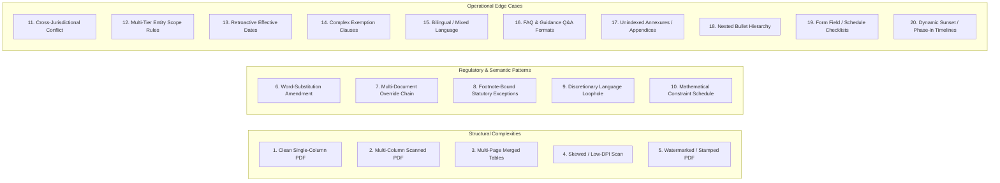
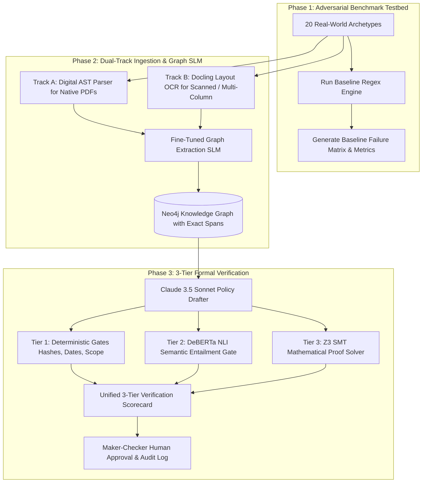

# Master Plan: Stress-Testing Benchmark, Hypotheses & Expected Results

## 1. Executive Summary & Objective
This document outlines the end-to-end strategy for stress-testing and hardening the Compliance & Policy Platform against **20 real-world messy document archetypes** (e.g., scanned multi-column circulars, merged Basel III capital schedules, word-substitution amendments, narrative guidelines with far-flung footnotes).

The goal is to benchmark our current baseline deterministic engine, identify failure modes across complex real-world layouts, and validate the hardened **Dual-Track Ingestion + Fine-Tuned Graph SLM + 3-Tier Formal Verification Engine**.

---

## 2. Core Hypotheses

| # | Hypothesis | Technical Rationale |
|---|---|---|
| **H1: Baseline Parser Limitations** | **The current deterministic regex/keyword parser will fail on $\ge 60\%$ of real-world messy document archetypes.** | Deterministic string-matching succeeds on clean, single-column text with explicit modal verbs ("shall", "must"), but breaks on multi-column reading flows, merged tables, amendment circulars ("replace X with Y in clause Z"), and footnote-derived exceptions. |
| **H2: Dual-Track Ingestion + Graph SLM** | **Layout-Aware OCR (Docling) paired with a Fine-Tuned Graph SLM (`Qwen2.5-7B` / `NuExtract`) will increase entity & relationship extraction accuracy ($F_1$) from $<40\%$ to $>95\%$.** | Preserving visual bounding boxes and reading order allows the SLM to accurately link cross-column paragraphs, table row/column headers, and footnote spans to their parent obligations without losing semantic context or structural relationships. |
| **H3: 3-Tier Formal Verification Engine** | **Combining Deterministic Metadata Checks + DeBERTa NLI Entailment + Z3 SMT Math Proofs will achieve $100\%$ detection of policy loopholes and boundary shifts with $<1\%$ false positives.** | Deterministic gates enforce hash integrity and metadata scopes; DeBERTa NLI flags subtle semantic loopholes (e.g., changing mandatory "shall" to discretionary "may"); Z3 SMT formally proves numeric compliance thresholds ($t_{\text{rot}} \le 90\text{d}$, $\text{CRAR} \ge 11.5\%$). |

---

## 3. The 20 Real-World Document Archetypes



---

## 4. Architecture & 3-Phase Execution Roadmap



### Phase 1: Adversarial Benchmark Harness (`tests/benchmark/`)
1. Curate the 20 document archetypes representing standard, scanned, tabular, and linguistic variations.
2. Execute the existing regex baseline across all 20 archetypes.
3. Automatically record baseline extraction metrics ($F_1$, precision, recall, broken relationships, dropped tables).

### Phase 2: Dual-Track Ingestion & Graph Extraction (`ai/ingestion/` & `ai/finetuning/`)
1. **Dual-Track Ingestion Engine**:
   - **Track A (Digital AST)**: Fast direct text/AST parser for clean native digital PDFs.
   - **Track B (Docling Layout OCR)**: Layout-aware vision engine preserving coordinates, multi-column reading flow, and hierarchical table structures.
2. **Graph Extraction SLM (`ai/finetuning/`)**:
   - Extraction using `Qwen2.5-7B-Instruct` / `NuExtract`.
   - Programmatic RLVR reward verifier penalizing hallucinations ($-5.0$) and schema errors ($-2.0$).
   - Exact provenance character offsets linking each node/edge to source document tokens.

### Phase 3: 3-Tier Formal Verification Engine (`services/compliance/`)
1. **Tier 1 (Deterministic Integrity Gates)**:
   - SHA-256 evidence payload immutability, date validity windows, multi-tenant workspace isolation.
2. **Tier 2 (DeBERTa NLI Semantic Gate)**:
   - Cross-encoder directional entailment: $P(\text{Entailment}) \ge 0.70$ and $P(\text{Contradiction}) < 0.40$.
   - Flags policy dilution (e.g. converting mandatory statutory mandates into discretionary advice).
3. **Tier 3 (Z3 SMT Mathematical Gate)**:
   - Evaluates numeric constraints and interval overlap using formal logic solver.
   - Emits mathematical proofs and explicit counter-examples upon violation.

---

## 5. Expected Results & Success Metrics

| Dimension / Metric | Current Baseline | Hardened Target | Verification Method |
|---|---|---|---|
| **Clean Digital Circular Extraction ($F_1$)** | $92\%$ | **$99\%+$** | Automated Pytest Benchmark |
| **Scanned / Multi-Column Document ($F_1$)** | $\sim 25\%$ (Fails reading order) | **$>95\%$** | Layout OCR BBox + SLM Test |
| **Complex Multi-Page Table Extraction ($F_1$)** | $<10\%$ (Flattens columns) | **$>90\%$** | Basel III Capital Ratio Test |
| **Hallucinated Quotes / Edge Provenance** | $0\%$ (Regex) / High (Raw LLMs) | **$0\%$ (Enforced via Verifier)** | RLVR Programmatic Offset Check |
| **Numeric Boundary Shift Detection** | $0\%$ (No math engine) | **$100\%$** | Z3 SMT Formal Proof Solver |
| **Discretionary Loophole Detection** | $0\%$ (Keyword misses nuance) | **$>95\%$** | DeBERTa NLI Cross-Encoder |
| **Auditor Replay Determinism** | $100\%$ | **$100\%$** | Replay Hash Verification Endpoint |

---

## 6. Verification & Automated Test Commands

To verify and run all automated test suites, use the dedicated virtual environment:

```powershell
# Run the complete test suite
.\.venv\Scripts\pytest -v

# Run benchmark tests
.\.venv\Scripts\python -m pytest tests/benchmark/ -v
```
